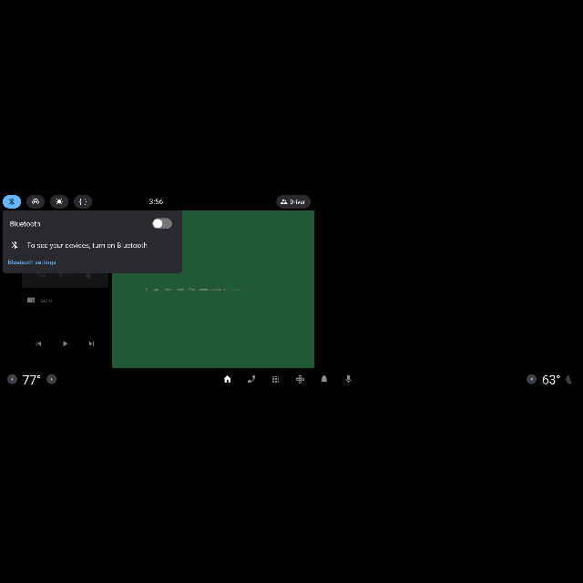
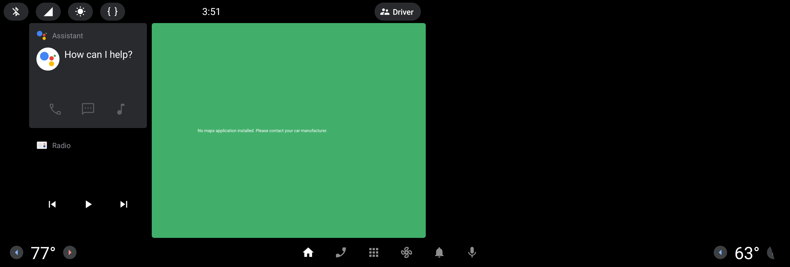

# 🤖 AI-compare-video

---

## ⚙️ インストール手順

### 1. リポジトリをクローンする

```bash
git clone https://github.com/letuan25112000/AI-compare-video.git
cd AI-compare-video
```

### 2. （任意）仮想環境を作成して有効化する

### Windows の場合

```bash
python -m venv venv
venv\Scripts\activate
```

### Linux / macOS の場合

```bash
python -m venv venv
source venv/bin/activate
```

### 3. 依存関係をインストールする

```bash
pip install -r requirements.txt
```

### 4. 実行方法

```bash
python main.py
```

http://localhost:5000/ また　http://127.0.0.1:5000/
にアクセスしてください。

## 現場的のトレーニングデータ作成

### 1.フォルダ構成

YOLO が認識できるデータセット構成は以下のようになります：
例：dataset_example フォルダを確認してください

```
dataset/
├── images/
│   ├── train/
│   │   ├── image1.jpg
│   │   ├── image2.jpg
│   └── val/
│       ├── image3.jpg
│       ├── image4.jpg
│
├── labels/
│   ├── train/
│   │   ├── image1.txt
│   │   ├── image2.txt
│   └── val/
│       ├── image3.txt
│       ├── image4.txt
│
└── dataset.yaml
```

### 2.dataset.yaml ファイル

このファイルで、YOLO に学習用データの場所とクラス情報を教えます。

例：

```yaml
train: ./images/train
val: ./images/val

nc: 6
names: ["Bluetooth", "Wifi", "Celular", "Hotspot", "Brightness", "Development"]
```

・train: 学習用画像フォルダへのパス

・val: 検証用画像フォルダへのパス

・nc: クラス数（例: 3 クラス）

・names: クラス名のリスト

### 3. ラベルファイル（.txt）の形式

各画像に対応する .txt ファイルを同じ名前で作成します。

```
image1.jpg
image1.txt
```

.txt ファイルの中身は以下のようなフォーマットになります：

```
<class_id> <x_center> <y_center> <width> <height>
```

例：

・dataset/train/images/image_002.jpg


・dataset/train/labels/image_002.txt

```
0 0.020028 0.344936 0.030913 0.020681
2 0.061390 0.345568 0.030913 0.019418
4 0.101445 0.345481 0.029171 0.020463
5 0.143243 0.345916 0.030042 0.020463
```

クラス 0 の物体が、画像の中央(0.020028, 0.344936)、幅 0.030913、高さ 0.020681

### 4.　学習コマンドの例

```bash
yolo train model=yolov8n.pt data=dataset.yaml epochs=100 imgsz=640
```

トレーニングしたモデルを/models フォルダにコピーします。

### 5. ニャトのノート

・全体画面入れた方がいいです
例：

・アイコンや認証したい物体が全ケースを入れた方がいい
・アイアイずつをトレーニングデータにならないと思います
例：これは NG


